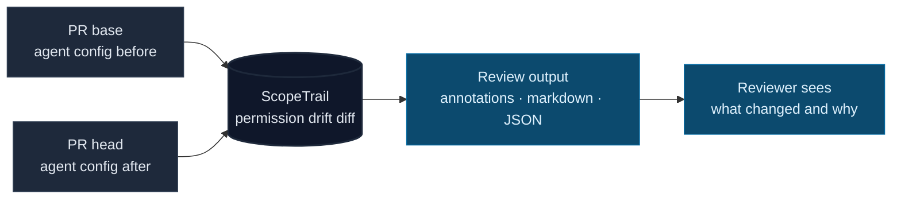
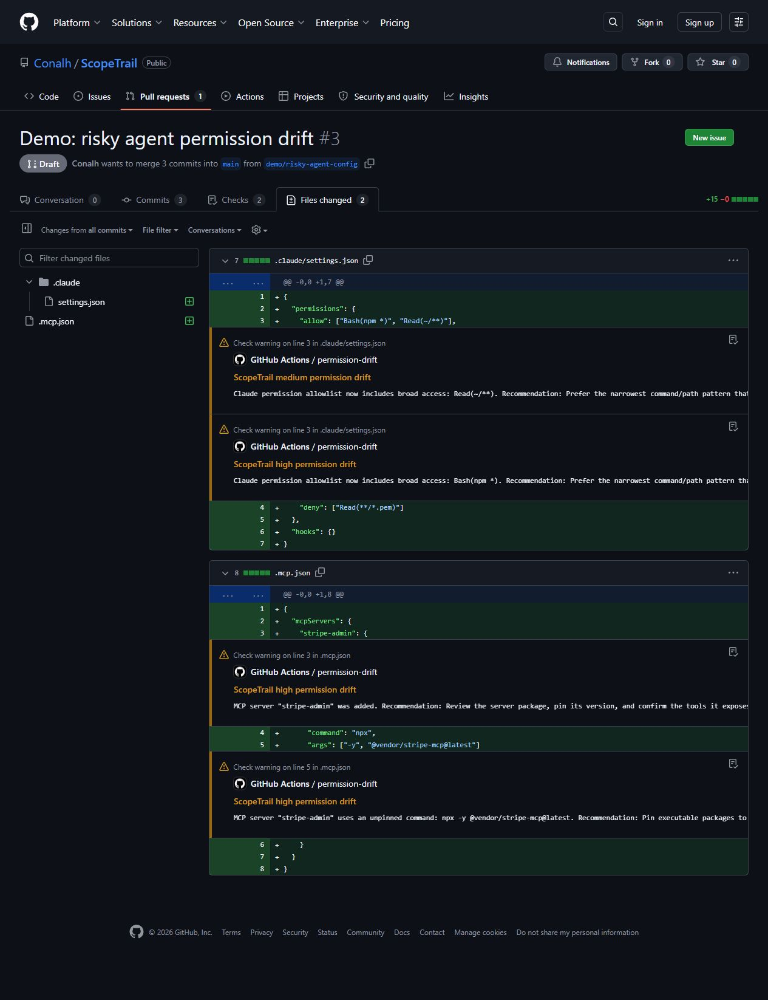

# ScopeTrail

[](LICENSE)
[](https://www.typescriptlang.org/)
[](#how-it-works)
[](https://github.com/Conalh/ScopeTrail/releases)

**A PR-level permission drift detector for AI-agent configuration.** ScopeTrail compares agent config files between pull-request base and head, then reports what permissions, MCP servers, hooks, and sandbox settings changed.

AI-agent review is no longer just code review. A PR can leave the application logic alone while quietly widening `Bash(npm *)`, removing `Read(.env)`, adding an unpinned MCP server, or enabling network access in Codex. ScopeTrail makes that config drift visible before the new permission surface becomes the default behavior for every future agent run.



**See also:** [PolicyMesh](https://github.com/Conalh/PolicyMesh) for contradictions across current policy files · [CapabilityEcho](https://github.com/Conalh/CapabilityEcho) for capability drift through code · [GovVerdict](https://github.com/Conalh/GovVerdict) for one merged suite verdict.

## Why this exists

AI coding agents are governed by repo-local files: MCP configs, Claude settings, Codex config, hooks, and sandbox policy. Those files are just as load-bearing as source code, but normal PR review tends to treat them as setup noise.

ScopeTrail exists for the moment when the task says “add billing endpoint” and the diff also changes the agent’s future permissions. It answers the review question directly: **what did this PR make the agent newly able to do?**

## What it catches

| Drift class | Example |
| --- | --- |
| **MCP drift** | New server added, command changed, `@latest` introduced, Windsurf `serverUrl` changed. |
| **Claude permission drift** | Broad allow rules added, deny rules removed, hooks added/removed/swapped. |
| **Codex drift** | Sandbox elevation, weaker approval policy, network access enabled, trusted-project changes. |
| **Review drift** | Config changes that look harmless in a file-by-file diff but materially change the agent surface. |

## Demo

Live demo PR: [Demo: risky agent permission drift](https://github.com/Conalh/ScopeTrail/pull/3)

That PR intentionally adds a new `stripe-admin` MCP server, an unpinned `@latest` MCP package, and broad Claude Code rules: `Bash(npm *)` and `Read(~/**)`.

ScopeTrail reports `HIGH` permission drift and emits GitHub warning annotations on the risky config lines.



For a PR that exercises the whole suite at once, see [agent-gov-demo PR #1](https://github.com/Conalh/agent-gov-demo/pull/1).

## Quickstart

ScopeTrail isn't published to npm yet — clone, build, and run against any repo:

```bash
git clone https://github.com/Conalh/ScopeTrail && cd ScopeTrail
npm install && npm run build
node dist/index.js diff --repo . --base main --head HEAD --format text
```

Or as a GitHub Action on pull requests:

```yaml
name: ScopeTrail
on: pull_request
permissions:
  contents: read
jobs:
  scopetrail:
    runs-on: ubuntu-latest
    steps:
      - uses: actions/checkout@v6
        with:
          fetch-depth: 0      # required: ScopeTrail compares base..head
      - uses: Conalh/ScopeTrail@v0.2.0
        with:
          fail-on: none       # start advisory; raise to high/critical later
```

The Action writes a Markdown report to the GitHub step summary and emits PR-visible warning annotations on the exact config lines that drifted.

Pilot ScopeTrail in a real repository and share team feedback in the [active pilot issue](https://github.com/Conalh/ScopeTrail/issues/18).

## Local development

```powershell
npm install
npm run build
node dist/index.js diff --old test/fixtures/combined/old --new test/fixtures/combined/new --format markdown
```

## Example output

Text output against the bundled `test/fixtures/combined` fixture:

```
ScopeTrail permission drift: CRITICAL
[HIGH] stripe-admin: MCP server "stripe-admin" was added.
[HIGH] stripe-admin: MCP server "stripe-admin" uses an unpinned command: npx -y @vendor/stripe-mcp@latest.
[HIGH] Bash(npm *): Claude permission allowlist now includes broad access: Bash(npm *).
[MEDIUM] Read(~/**): Claude permission allowlist now includes broad access: Read(~/**).
[CRITICAL] Read(.env): Claude permission deny rule was removed: Read(.env).
[HIGH] PreToolUse: Claude hook "PreToolUse" was removed.
```

`--format json` emits the canonical [agent-gov-core](https://github.com/Conalh/agent-gov-core) `Report` envelope so cross-tool reviewers like GovVerdict can merge findings across the suite:

```json
{
  "schemaVersion": "1.0",
  "tool": "scope_trail",
  "rating": "critical",
  "findings": [
    {
      "tool": "scope_trail",
      "kind": "scope_trail.permission_deny_removed",
      "severity": "critical",
      "message": "Claude permission deny rule was removed: Read(.env).",
      "location": { "file": ".claude/settings.json" },
      "data": {
        "subject": "Read(.env)",
        "recommendation": "Keep deny rules for secrets, credentials, and protected files unless a reviewer approves the removal."
      },
      "fingerprint": "b3242ffa5f6b40d8"
    }
  ]
}
```

## How it works

ScopeTrail is **local-only**. It reads the checked-out repository, materializes the two git refs into temp directories, runs detectors over them, and prints the result. It uploads nothing, calls no external services, and has no required API keys.

The detectors cover the surfaces an AI agent can actually escalate through:

- **MCP** — `.mcp.json`, `.cursor/mcp.json`, `.vscode/mcp.json`, `.codeium/windsurf/mcp_config.json`, sample/template/disabled variants, and prefixed sample files such as `claude_mcp_config.json`.
- **Claude Code settings** — `.claude/settings.json`, including widened allow rules, removed deny rules, and added / removed / command-swapped hooks.
- **Codex** — `.codex/config.toml`, including sandbox elevation, weakened approval policy, network access, trusted-project changes, and `[mcp_servers.NAME]` additions / unpinned commands.

Findings carry a `severity` (`low` / `medium` / `high` / `critical`) and the report's overall `rating` is the max severity across findings. `--fail-on` gates CI on that rating.

## Design choices worth flagging

- **Diff-first.** ScopeTrail cares about what changed in this PR, not whether the repo already had historical config debt.
- **Line-level review output.** Findings point at the changed config lines so reviewers can discuss a concrete permission change.
- **Local-only by design.** The tool does not need hosted state or access to your secrets.
- **Suite-shaped output.** JSON uses the shared `Finding` contract so GovVerdict can dedupe it with PolicyMesh, CapabilityEcho, TaskBound, and SessionTrail.

## Options

CLI:

| Flag | Description |
| --- | --- |
| `--repo <path>` | Repo to inspect (defaults to `cwd`). Pair with `--base` / `--head`. |
| `--base <ref>` | Base git ref or SHA. |
| `--head <ref>` | Head git ref or SHA. |
| `--old <dir>` | Old snapshot directory (alternative to git mode). |
| `--new <dir>` | New snapshot directory (alternative to git mode). |
| `--format <fmt>` | `text` (default), `markdown`, `json`, or `github`. |
| `--out-markdown <path>` | Also write a Markdown report to this path. |
| `--out-json <path>` | Also write the canonical JSON report to this path. |
| `--fail-on <rating>` | Exit 1 when rating >= `low` / `medium` / `high` / `critical`. Default `none`. |

GitHub Action inputs (`Conalh/ScopeTrail@v0.2.0`):

| Input | Default | Description |
| --- | --- | --- |
| `repo` | `$GITHUB_WORKSPACE` | Repo path to inspect. |
| `base` | PR base SHA | Base ref. |
| `head` | PR head SHA | Head ref. |
| `fail-on` | `none` | Severity that fails the action. |

Action outputs: `rating` (`none`/`low`/`medium`/`high`/`critical`) and `finding-count`.

## Part of the agent-gov suite

Local-only OSS tools that review AI-agent PRs and coding sessions for config drift, policy mismatches, and scope creep. Each tool covers an orthogonal failure mode; each emits the same `Finding` shape so GovVerdict can merge them into one verdict.

| Repo | What it catches |
| --- | --- |
| **ScopeTrail** *(this repo)* | Agent config drift between PR base and head. |
| [PolicyMesh](https://github.com/Conalh/PolicyMesh) | Contradictory agent instructions and config drift that make behavior non-reproducible. |
| [CapabilityEcho](https://github.com/Conalh/CapabilityEcho) | Capability drift introduced by code, manifests, workflows, and Dockerfiles. |
| [TaskBound](https://github.com/Conalh/TaskBound) | Scope creep between the stated task and the actual diff. |
| [SessionTrail](https://github.com/Conalh/SessionTrail) | Risky runtime behavior in Cursor / Claude Code / Codex session transcripts. |
| [GovVerdict](https://github.com/Conalh/GovVerdict) | Merges JSON reports from the tools above into one deduped review. |
| [agent-gov-core](https://github.com/Conalh/agent-gov-core) | Shared parsers, the canonical `Finding` schema, and `mergeFindings`. |
| [agent-gov-demo](https://github.com/Conalh/agent-gov-demo) | Demo sandbox with a rogue PR that fires all five reviewers. |

MIT. Bug reports and false-positive reports welcome via [Issues](https://github.com/Conalh/ScopeTrail/issues).
